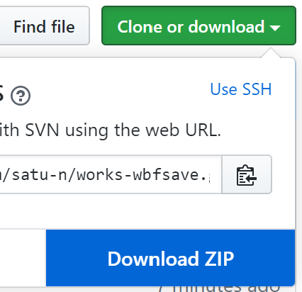

# これは何？

一行でいうと  
**WhiteboardFoxによる板書の高画質保存を支援するツール**  
です

以下、OSはWindows10、ブラウザはChromeを仮定します

[WhiteboardFox][WhiteboardFox]という素晴らしいフリーのWebホワイトボードサービスがあります  
この板書を**参照性のために画像として保存したい**方も少なくないと思うのですが  
標準の保存機能では[この程度][before]の画質しか実現しません

一方、**Screenpresso**という縦スクロール領域を連続してキャプチャできるアプリがあります  
ということは、たいてい縦長である板書を横幅いっぱいに表示してScreenpressoを利用すれば高画質保存ができそうです  
ところが、WhiteboardFoxは正確に縦スクロールするしくみを標準では備えていません  

そこで、当ツールはWhiteboardFoxにおける正確な縦スクロールを代行し  
Screenpressoによるキャプチャを支援します

# 導入に要する時間

PCはネットサーフィンくらいにしか使わないという方でも **30分** で導入できます

# 導入方法

1.  `Win`+`S`キーを押し検索ボックスに`sys`と入力、候補に出た`システム情報`を開き  
    `システムの種類`が`x64-ベース PC`であることを確認します

1.  [Miniconda][Miniconda]のページから`Miniconda3 Windows 64-bit`をダウンロードし起動、  
    指示に従ってインストールします

1.  `Win`+`S`キーを押し検索ボックスに`ana`と入力、候補に出た`Anaconda Prompt`を開き  
    次の例のとおりに入力します
    ```
    (base) C:\Users\satun>
    (base) C:\Users\satun> mkdir tools
    (base) C:\Users\satun> cd tools
    (base) C:\Users\satun\tools> mkdir wbf_scroll
    (base) C:\Users\satun\tools> cd wbf_scroll
    (base) C:\Users\satun\tools\wbf_scroll>
    ```
    上記最終行を`(base)>`と略記することにすると  
    ```
    (base)> conda create -n wbf_scroll selenium chromedriver-binary
    (base)> activate wbf_scroll
    (wbf_scroll)>
    ```

1.  このページの`Clone or download`から`Download ZIP`を選択しダウンロードしたZIPを右クリック、  
    `すべて展開`し`works-wbf_scroll-master`以下を先に作成した`tools\wbf_scroll`以下にコピーします

    

1.  `Win`+`S`キーを押し検索ボックスに`アプリ: screenpresso`と入力、  
    Microsoft Storeから**Screenpresso**をインストールします


# 利用方法

1.  `Anaconda Prompt`に戻り、次の例のとおり入力します
    ```
    (wbf_scroll)>
    (wbf_scroll)> python main.py 200 1 666666-4444-4444
    ```
    ただし、`200`としたのは1回のスクロール量、`1`としたのはスクロールごとの休止時間（秒）、  
    `666666-4444-4444`としたのは保存したいホワイトボードのURL末尾のIDです
    ```
    Prepare Screenpresso scroll mode.
    Are you ready?
    :
    ```
    との表示とともにChromeウィンドウが立ち上がります  
    ウィンドウを最大化し、板書を適度なスケールに調整します

1.  `Win`+`Shift`+`PrintScr`キーを押し`スタート`を選択し、縦スクロール領域を設定します

1.  `Anaconda Prompt`に戻り、次のとおり入力します
    ```
    Are you ready?
    : y
    ```

1.  ホワイトボードの縦スクロールが始まります  
    スクロールの合間にホワイトボード外を**左クリック**することで  
    Screenpressoにキャプチャの合図をします

1.  板書の末尾までスクロールしたらホワイトボード外を**右クリック**することで  
    Screenpressoに終了の合図をします  
    他方のプログラムは`Anaconda Prompt`に`Ctrl+C`を入力することで終了します

1.  Screenpressoが合成するのを待って完成です！

# 課題

次の問題があり、解決が期待されます

* 板書が長すぎるとScreenpressoのキャパシティを超えてしまう
* 板書のように疎な画像に対してはScreenpressoによる合成が失敗しがち

ひとつの方針は  
**Screenpressoから独立したスクリプトに育てる**ことでしょう  
いまや定量スクロールは実現したので  
あとは同量のheightの固定領域のキャプチャを並べれば良いわけです

さらに  
余白の自動判定ができれば次のようなことも可能でしょう
1. Slackで `/wbf 666666-4444-4444` のようなコマンドを一発たたく
   * AWS Lambdaなどに置いたスクリプトが走る
2. 直後に板書の画像が投稿される

# 結び

標準で高画質保存ができる [Microsoft Whiteboard][Microsoft Whiteboard] を使いましょう

[WhiteboardFox]:https://whiteboardfox.com/
[before]:images/before.png
[Miniconda]:https://docs.conda.io/en/latest/miniconda.html
[Microsoft Whiteboard]:https://products.office.com/ja-jp/microsoft-whiteboard/digital-whiteboard-app
